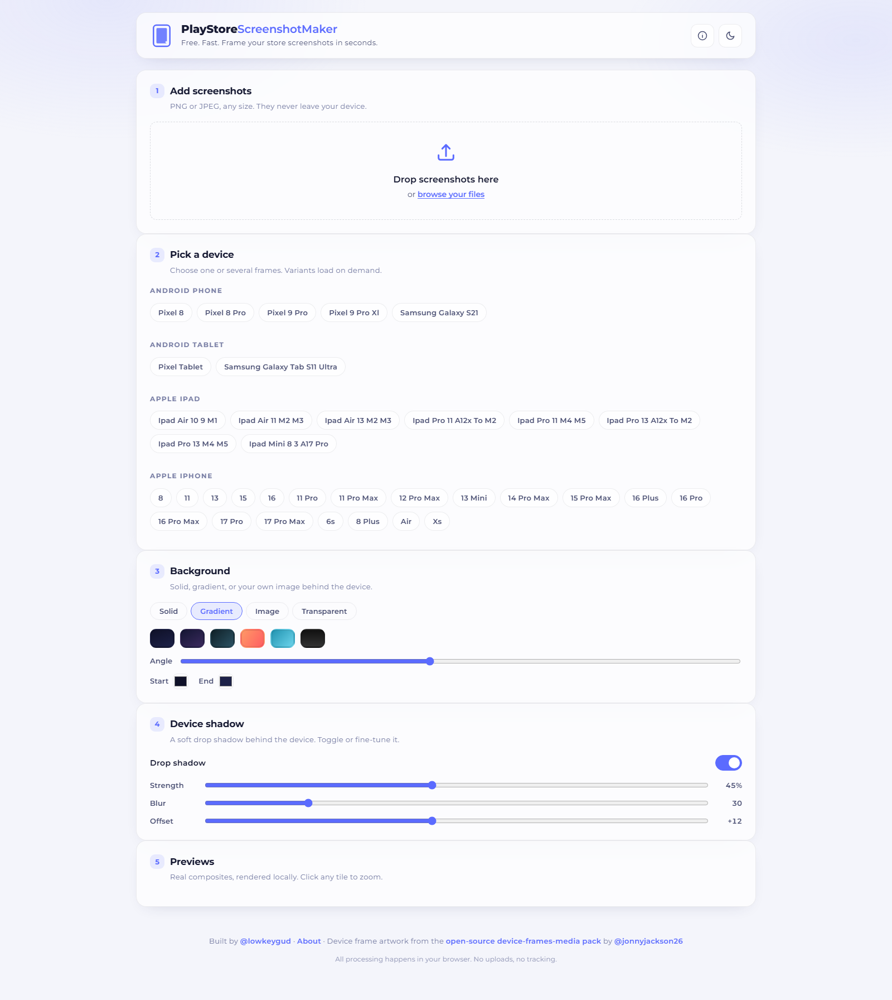
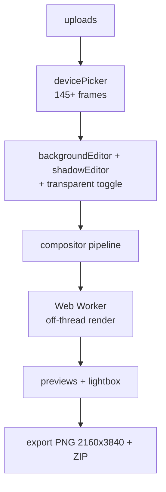

# PlayStore Screenshot Maker

> Client-side studio that frames screenshots in 145+ device frames and exports Play Store-ready PNGs and ZIPs — no uploads, no server.

**Stack:** Vanilla TypeScript · Canvas + Web Worker · Vite 6 · Vitest + Puppeteer smoke · Sharp frame pipeline · GitHub Pages deploy



| Fact | Evidence |
| --- | --- |
| Fixed export contract | `2160×3840` PNG + ZIP via `export.ts` + file-saver/jszip |
| 145+ frames, zero binaries in git | `scripts/fetch-frames.mjs` generates `public/` on demand (`npm run frames`) |
| Heavy work off the UI thread | Compositing in a Web Worker (`worker.format = es`) with `done/total` progress |
| Tested static site with CI | Vitest (`util.test.ts`) + Puppeteer `smoke.mjs` + `deploy.yml` (Node 20 → Pages) |

## The Problem

Play Store listings need device-framed screenshots at exact resolutions, but screenshot tools either upload your captures to a server or lock frames behind paywalls. Designers need shadow, background, and transparency control with pixel-exact output.

## The Solution

A single-page Vite app: upload screenshots → pick devices → tune background and shadows → composite on canvas in a Web Worker → preview in a lightbox → export PNG/ZIP. Everything runs in the browser; nothing is uploaded anywhere.



## Key Features

**Device frames.** 145+ frames fetched at build time, selectable per tile. Why it matters: Play listings need recognizable hardware, not bare screenshots.

**Shadow and background control.** Dedicated editors including transparent-background support (the second commit's feature). Why it matters: store art direction lives in depth and backdrop choices.

**Pixel-exact export.** Fixed `2160×3840` output as single PNGs or a ZIP batch. Why it matters: Play Console rejects wrong-size assets — the contract is the feature.

**Fully client-side.** No backend, no uploads, no keys. Why it matters: screenshots often contain unreleased product — they should never leave the machine.

## Key Engineering Decisions

**Problem → Constraint → Decision → Tradeoff → Result**

1. **145 binaries would bloat the repo.** Constraint: version-controlling device frames at that scale is untenable. Decision: `fetch-frames.mjs` (Sharp-assisted) generates `public/` on demand; frames are gitignored. Tradeoff: contributors must run `npm run frames` before frames appear. Result: a lean repo with reproducible assets.

2. **Compositing jank on large canvases.** Constraint: `2160×3840` canvas work blocks the UI thread. Decision: Web Worker pipeline with progress reporting. Tradeoff: worker message plumbing instead of direct canvas calls. Result: responsive editing during heavy renders.

3. **Release confidence without a backend.** Constraint: visual tools need end-to-end proof, not just unit tests. Decision: Vitest unit tests *plus* a headless Puppeteer smoke over the static build (`npm run smoke`), all gated in `deploy.yml`. Tradeoff: browser-binary dependency in CI. Result: build-and-exercise coverage on every deploy — the only repo in the portfolio with committed CI.

## Iteration Story

Two commits, both legible: `initial release` (pipeline, frames, worker export, deploy workflow in one drop) → `shadow + transparent` (new `shadowEditor.ts`, transparent path through pipeline/export/previews/lightbox, file-picker bubbling fix, `probe.mjs`). Small history, complete tool — iteration happened before the first commit, not after.

## User Experience

Upload screenshots, pick devices per tile, tune background and shadow, zoom tiles, preview in the lightbox, and export. Keyboard shortcuts and toasts keep the flow fast. The whole studio is one page — upload-to-ZIP without navigation.

## Results & Evidence

**Verifiable:** frame pipeline, worker, export contract, tests, smoke script, and the Pages deploy workflow are all committed.

**Honest limits:** pass status of `npm test` / `npm run smoke` is not recorded in the repo — rerun to confirm. No usage metrics exist. The only portfolio repo with CI earns that claim explicitly.

## Technical Details

| Area | Detail |
| --- | --- |
| Runtime | Vanilla TS, no framework; Vite 6, TypeScript 5.6 |
| Deps | `@fontsource/montserrat`, `file-saver`, `jszip`; dev: `vitest`, `sharp`, `puppeteer-core` |
| Key files | `src/main.ts` (boot), `compositor/pipeline.ts`, `devicePicker.ts`, `backgroundEditor.ts`, `shadowEditor.ts`, `export.ts`, `previews.ts`, `lightbox.ts`, `worker.ts`, `state.ts`, `scripts/` |
| Errors | `toast()`-surfaced try/catch; export progress `done/total` |
| Secrets | None — no `.env`, no keys |
| Deploy | `vite.config.ts` base `/playstore-screenshot-maker/`; `.github/workflows/deploy.yml` → GitHub Pages |

## Setup

1. **Prerequisites:** Node 20+, npm.
2. **Clone and install:**
   ```bash
   git clone https://github.com/LowkeyGud/playstore-screenshot-maker.git
   cd playstore-screenshot-maker
   npm install
   ```
3. **Frames (required):**
   ```bash
   npm run frames   # downloads + generates the 145 frames into public/
   ```
4. **Run:**
   ```bash
   npm run dev        # vite dev server
   npm run build      # tsc --noEmit + vite build → dist/
   npm run preview    # verify the production build locally
   ```
5. **Verify:** upload a screenshot, frame three devices, tune shadow, export one PNG (confirm `2160×3840`) and one ZIP; run `npm test` and `npm run smoke` green.
6. **Common issues:** blank frames → `npm run frames` not run; smoke failure → browser executable path for `puppeteer-core` missing; wrong base path on Pages → confirm the `vite.config.ts` base matches the repo slug.

## Lessons / Takeaways

- Generated-not-committed assets kept the repo lean without losing reproducibility — the frame script *is* the asset strategy.
- A two-script test strategy (unit + headless smoke) fits visual tools better than unit tests alone.
- Next step is preset export profiles per Play listing slot — the pipeline already supports it.

## Links

- Repository: `https://github.com/LowkeyGud/playstore-screenshot-maker`
- Live Demo: `https://lowkeygud.github.io/playstore-screenshot-maker/`

## Diagrams

Generated from the codebase with the mermaid-skill workflow (validate via Kroki → export SVG → vision self-check). Sources live in `docs/diagrams/` — edit the `.mmd`, re-render, review. SVG is the committed format.

**Export pipeline** (`docs/diagrams/pipeline.mmd` — upload → device picker → editors → worker → export):



## Screenshots

Captured from the live deployment:


